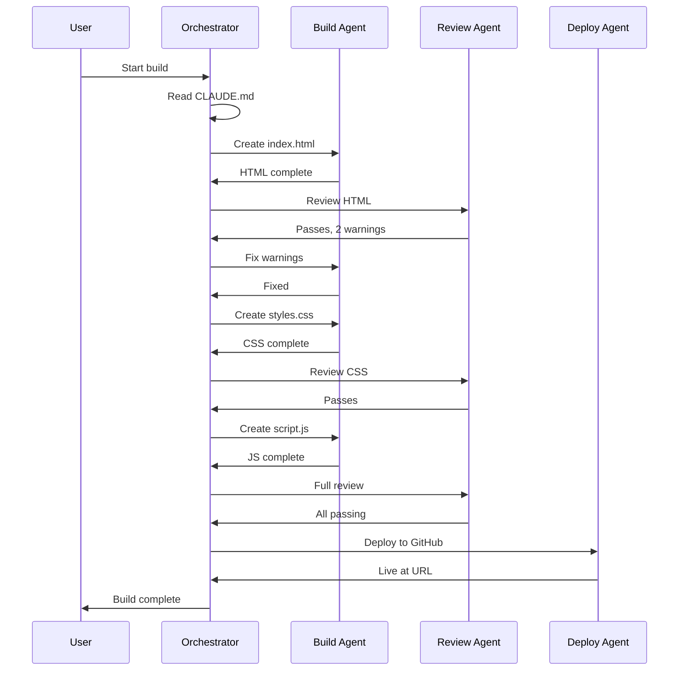

# Agency-Agents Configuration for Jordan Portfolio Build

## Overview

This document defines how agents coordinate for the portfolio build using the [agency-agents](https://github.com/msitarzewski/agency-agents) pattern.

## Agent Definitions

### 1. ORCHESTRATOR (Primary Session)

**Role**: Main Claude Code session that manages the build
**Reads**: CLAUDE.md, CONTEXT.md, this file
**Responsibilities**:
- Parse requirements from CLAUDE.md
- Track progress in CONTEXT.md
- Delegate tasks to specialized agents
- Resolve conflicts between agent outputs
- Make final decisions on implementation

**Trigger Commands**:
```bash
# Start orchestrator session
claude --dangerously-skip-permissions

# In session, load context
/read CLAUDE.md
/read CONTEXT.md
```

### 2. BUILD AGENT

**Role**: Creates and modifies HTML, CSS, JavaScript
**Specialization**: Frontend implementation, motion design
**Responsibilities**:
- Generate semantic HTML structure
- Implement CSS animations and layouts
- Write JavaScript for interactivity
- Ensure code quality and performance

**Delegation Pattern**:
```
When ORCHESTRATOR needs frontend code:
1. Describe the specific component needed
2. Reference relevant section in CLAUDE.md
3. BUILD AGENT generates code
4. ORCHESTRATOR reviews and integrates
```

**Quality Standards**:
- Valid HTML5 (no validator errors)
- CSS without !important overrides
- ES6+ JavaScript, no var
- 60fps animations

### 3. REVIEW AGENT

**Role**: Validates accessibility, performance, standards compliance
**Specialization**: QA, testing, optimization
**Responsibilities**:
- Check WCAG 2.1 AA compliance
- Verify keyboard navigation
- Test reduced-motion behavior
- Measure performance metrics

**Checklist Output**:
```markdown
## Review: [Component Name]

### Accessibility
- [ ] ARIA labels present
- [ ] Keyboard focusable
- [ ] Color contrast passing
- [ ] Reduced motion works

### Performance
- [ ] No layout thrashing
- [ ] Animations at 60fps
- [ ] No unused CSS

### Standards
- [ ] Valid HTML
- [ ] Valid CSS
- [ ] No console errors
```

### 4. DEPLOY AGENT

**Role**: Handles git operations and GitHub Pages deployment
**Specialization**: Version control, CI/CD
**Responsibilities**:
- Initialize git repository
- Create meaningful commits
- Push to GitHub
- Configure GitHub Pages
- Verify deployment

**Deployment Checklist**:
```bash
# Initialize
git init
git add .
git commit -m "Initial portfolio build"

# Connect to GitHub
git remote add origin https://github.com/nice-and-precise/jordan-portfolio.git
git branch -M main
git push -u origin main

# Then in GitHub UI:
# Settings > Pages > Source: Deploy from branch > main > / (root)
```

## Agent Communication Protocol

### Message Format
```
FROM: [AGENT_NAME]
TO: [AGENT_NAME]
TYPE: [REQUEST|RESPONSE|ISSUE|COMPLETE]
CONTEXT: [Brief description]
CONTENT: [Detailed message]
```

### Escalation Path
```
BUILD/REVIEW/DEPLOY issues → ORCHESTRATOR
ORCHESTRATOR uncertainty → Check CLAUDE.md
CLAUDE.md doesn't cover it → Ask user
```

## Workflow Example



## Context Handoff Between Sessions

If a session ends mid-build:

### Session End Procedure
1. Update CONTEXT.md with:
   - Current phase and task
   - Any uncommitted changes
   - Pending decisions
2. Commit progress to git
3. Note next action clearly

### Session Resume Procedure
1. Read CLAUDE.md for requirements
2. Read CONTEXT.md for progress
3. Check git status for uncommitted work
4. Continue from noted next action

## Using with Serena MCP

For persistent memory across sessions:

```
# Store important context
serena remember "Phase 2 complete, starting motion implementation"

# Retrieve context
serena recall "portfolio build progress"

# Store decision
serena remember "Decided to use CSS custom properties for colors"
```

## Troubleshooting Agent Coordination

### Issue: Conflicting outputs
**Solution**: ORCHESTRATOR makes final decision based on CLAUDE.md requirements

### Issue: Agent lacks context
**Solution**: Include relevant CLAUDE.md section in delegation message

### Issue: Build stalled
**Solution**: Check CONTEXT.md for last known state, restart from there

### Issue: Quality gate failures
**Solution**: REVIEW AGENT provides specific failures, BUILD AGENT fixes, iterate

## Success Metrics

The agent system is working well when:
- Build progresses through phases without stalling
- CONTEXT.md accurately reflects current state
- Quality gates catch issues before deployment
- Final site meets all CLAUDE.md requirements
